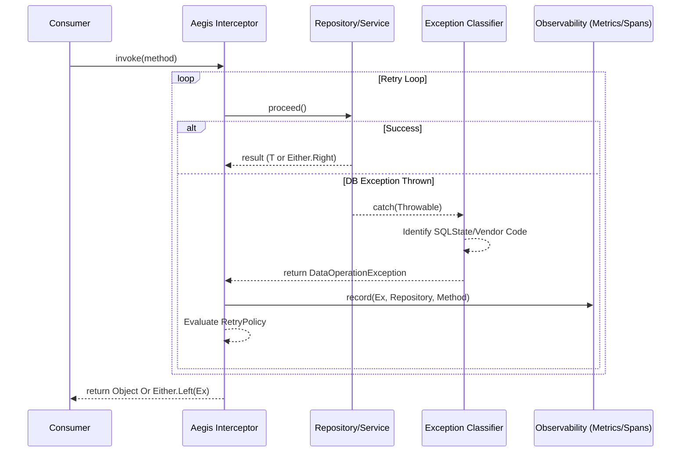

<div align="center">
  
  
  # Aegis DB Resilience Starter
  
  **Zero-Annotation. Production-Grade. Bank-Level Resilience for Spring Boot 3.x.**
  
  [](https://www.oracle.com/java/technologies/javase/jdk21-archive-downloads.html)
  [](https://spring.io/projects/spring-boot)
  [](https://opensource.org/licenses/MIT)
  [](#)
  [](https://www.vavr.io/)
  [](https://opentelemetry.io/)

  A sophisticated, auto-configuring starter that transforms messy database failures into a clean domain exception hierarchy. It adds intelligent retry mechanics and professional-grade observability signals without requiring a single change to your existing repository or service code.
</div>

---

## ⚡ Features at a Glance

| 🛡️ Resilience | 🧩 Functional | 📊 Observability | 🛠️ DX |
| :--- | :--- | :--- | :--- |
| **Intelligent Retry**: Exponential back-off tailored for database-specific transient faults. | **Monadic Errors**: Native support for Vavr `Either<Failure, Success>` patterns. | **Metrics First**: Automatic Micrometer counters and Prometheus-ready gauges. | **Zero Config**: Drop-in JAR that auto-discovers and protects every `@Repository`. |
| **Fault Isolation**: Precise classification via SQLState and Vendor codes. | **Null Safety**: Strict enforcement of non-null contracts in exception data. | **Tracing**: Deep OpenTelemetry integration with span enrichment and events. | **Domain Taxonomy**: Stable hierarchy that hides vendor-specific leakages. |

---

## 📖 Table of Contents

- [🚀 Why Aegis?](#why-aegis)
- [🏗️ Architecture Overview](#architecture-overview)
- [💎 Design & Core Philosophy](#design--core-philosophy)
- [⚖️ The Aegis Difference](#-the-aegis-difference)
- [🛠️ Built for Modern Infrastructure](#-built-for-modern-infrastructure)
- [λ Functional Error Handling](#functional-error-handling-vavr)
- [🏆 Best Practices](#best-practices-handling-exceptions)
- [⚙️ Getting Started](#getting-started)
- [📂 Exception Hierarchy](#exception-hierarchy)
- [🔄 Retry Behaviour](#retry-behaviour)
- [📝 Configuration Reference](#configuration-reference)
- [📡 Observability](#observability)
- [🧩 Custom Classifiers](#custom-classifiers)
- [🧪 Testing](#testing)
- [🛡️ Security Model](#security-model)

---

## 🚀 Why Aegis?

In standard Spring Boot, a single database failure (like a unique-constraint violation) often leaks raw `SQLException` details or deep stack traces to the presentation layer. It lacks consistency in retry logic and often ignores critical observability needs.

**Aegis transforms your persistence layer into a resilient fortress:**

*   **Intercepts Automatically**: Every `@Repository` and `@Service` bean is protected via high-precedence AOP.
*   **Classifies Precisely**: Maps vendor-specific mess to clean types like `DataIntegrityException` or `DataConflictException`.
*   **Retries Intelligently**: Only retries transient errors (deadlocks, timeouts) using exponential back-off.
*   **Emits Signals**: Publishes Micrometer counters and OTel span events for every single fault.

> [!IMPORTANT]
> **Zero Leakage Policy**: Aegis ensures that no raw SQL details or internal schema names ever escape to the client. It forces a clean separation between database faults and transport responses.

---

## Architecture Overview

```
@Service / @Repository bean
         │
         ▼
DatabaseResilienceInterceptor  ◄── AOP advice (auto-applied or via @ResilientRepository)
         │
         ├─► DatabaseExceptionClassifier chain
         │        └─► DefaultDatabaseExceptionClassifier
         │              ├── SQLState (23xxx, 40xxx, 08xxx, …)
         │              ├── Spring DataAccessException hierarchy
         │              └── JPA / Hibernate exception types
         │
         ├─► DatabaseOperationMetrics
         │        ├── Micrometer counter  (db.operation.failures)
         │        ├── OTel span attributes + event
         │        └── MDC-enriched structured log
         │
         └─► RetryTemplateFactory  (transient/timeout/unavailable only)
                  └── ExponentialBackoffRetryPolicy

Domain exception thrown to caller:
  DataIntegrityException  │ DataNotFoundException  │ DataConflictException
  DataTimeoutException    │ DataUnavailableException│ DataAccessProgrammingException
  TransientDataOperationException

(Consumers are free to catch these exceptions in their own @ControllerAdvice, Interceptor, or Error Handler)
```

---

## Design & Core Philosophy

The Aegis Database Resilience Library is designed to solve a fundamental problem in modern microservices: **Database faults are inevitable, but their handling shouldn't clutter your business logic.**

The core idea is to transform "raw" database errors—which are often messy, vendor-specific, and hard to inspect—into **clean, classified, and actionable domain objects** while providing automated resilience.

### 1. Functional "Safety Net" (Vavr Integration)
Aegis natively supports **functional error handling**. Instead of throwing exceptions that bubble up and crash the stack, Aegis allows your methods to return an `Either<DataOperationException, T>`.
- **The Idea**: Treat errors as data. If a database operation fails, the Interceptor catches it and returns the error on the `Left` side of the `Either`.
- **Benefit**: No more `try-catch` blocks. You can use standard functional patterns like `.map()`, `.peekLeft()`, or `.getOrElse()` to handle errors gracefully.

### 2. Exception Taxonomy over Message Matching
Raw `SQLException` messages change between database versions and vendors. Aegis uses a multi-stage **Classifier** to map these into a stable hierarchy:
- `DataConflictException` (Optimistic locking)
- `DataIntegrityException` (Unique/FK/Not-Null violations)
- `TransientDataOperationException` (Deadlocks/Temporary lock timeouts)
- `DataUnavailableException` (Connectivity/Pool exhaustion)
- `DataNotFoundException` (Record missing)

### 3. Transparent AOP Resilience
The API uses Spring AOP to apply logic without changing your code:
- **Explicit**: Use `@ResilientRepository` on specific classes.
- **Implicit**: Use `aegis.db.resilience.auto-apply=true` to automatically protect every `@Repository` in your project.
- **Granular Control**: Use `@RetryPolicy` at the method level to customize how many times to retry specific errors.

---

## ⚖️ The Aegis Difference

### Standard Spring (Messy)
```java
try {
    repository.save(entity);
} catch (TransactionSystemException e) {
    // Digging through nested causes manually...
    if (e.getRootCause() instanceof SQLException se && "23505".equals(se.getSQLState())) {
        // Vendor-specific logic leaked into your service layer
    }
}
```

### With Aegis (Clean & Decoupled)
```java
try {
    repository.save(entity);
} catch (DataIntegrityException e) {
    // Precise, typed, and vendor-neutral hierarchy
    if (e.violationType() == ViolationType.UNIQUE) { ... }
}
```

---

## 🛠️ Built for Modern Infrastructure

Aegis is engineered for high-performance, bank-grade applications using a premium tech stack:

*   **☕ Java 21 Core**: Leverages Pattern Matching and modern syntax for high-speed exception classification.
*   **λ Vavr Monads**: Enables "Railway Oriented Programming" for safer, more predictable error flows.
*   **🛡️ High-Precedence AOP**: Tuned ordering ensures Aegis captures failures *outside* the transaction commit phase.
*   **📊 Low-Overhead Metrics**: Powered by Micrometer and Prometheus for real-time fleet observability.
*   **🌍 Cloud-Native Tracing**: Native OpenTelemetry integration for distributed tracing and fault analysis.

---

### How it Works: The Execution Flow



### Key Components

*   **`DatabaseResilienceInterceptor`**: The "brain" of the system. It manages the retry loop, coordinates classification, and handles the functional return type conversion.
*   **`DefaultDatabaseExceptionClassifier`**: The "translator." It uses Spring's `SQLExceptionTranslator` and SQLState matching to ensure the library is database-agnostic.
*   **`DatabaseOperationMetrics`**: The "eye." It automatically publishes Micrometer gauges and OpenTelemetry spans for every fault.

### Why use this instead of standard Spring `@Retryable`?
Aegis is **Database-Aware**. It knows the difference between a `Deadlock` (which should be retried) and a `Unique Violation` (which should never be retried). It provides the exact context of the database failure within its domain exceptions, making it far superior for data-intensive applications.

---

## Deep Dive: How It Works & Limitations

Because Aegis deeply integrates with Spring AOP, it is useful to understand exactly how it handles common database lifecycle behaviors and where it might fall short.

### Common Use Cases & Exception Handling

Aegis natively parses a comprehensive suite of errors. Here are the core use cases and how Aegis tackles them:

#### 1. Data Integrity Violations & The `@Transactional` Commit Boundary
**Scenario**: Inserting a user where an email address triggers a database-level `UNIQUE` constraint violation.
Often when using JPA or Hibernate, a call to `repository.save()` doesn't actually hit the database right away due to optimization and caching (the "lazy flush"). The `UNIQUE` constraint exception is instead thrown by the `@Transactional` wrapper during the **commit phase** as the method is exiting, often surfacing as a nested and tangled `TransactionSystemException`.

```java
@Service
public class UserService {
    @Transactional
    public User registerUser(String email) {
        // The unique constraint fault typically fires implicitly at method exit.
        return repository.save(new User(email));
    }
}

// In your calling layer (e.g. Controller):
try {
    userService.registerUser("duplicate@test.com");
} catch (DataIntegrityException ex) {
    if (ex.violationType() == DataIntegrityException.ViolationType.UNIQUE) {
        return ResponseEntity.status(409).body("Email already exists.");
    }
}
```
**The Aegis Advantage**: Because Aegis explicitly forces its AOP precedence very high (`Ordered.LOWEST_PRECEDENCE - 200`), it sits *outside* the Spring `@Transactional` wrapper. When the transaction commit fails, the Aegis interceptor catches the tangled `TransactionSystemException`, extracts the root cause (the SQL Unique constraint), maps it to a `DataIntegrityException(UNIQUE)`, and safely hands it down to the caller, completely hiding the JPA delayed flush timings.

#### 2. Transient Operations & Implicit Deadlocks
**Scenario**: Two concurrent threads try to lock the same database rows in exact opposite orders. The database forcefully kills one transaction, producing a `DeadlockLoserDataAccessException` (SQL State `40P01`).

```java
@Service
public class OrderService {
    @Transactional
    public void processOrder(Order order) {
        // If thread A locks Payment then Inventory, 
        // and thread B locks Inventory then Payment, a deadlock exception is thrown.
        inventoryRepository.deduct(order.getItems());
        paymentRepository.charge(order.getAmount());
    }
}
```
**The Aegis Advantage**: Instead of immediately returning a generic 500 error, Aegis identifies the deadlock as a `TransientDataOperationException`. Based on your `@RetryPolicy`, Aegis intercepts the exception, automatically applies a backoff window, and silently **re-executes the method**. If the retry succeeds, the consumer never knows the deadlock happened.

#### 3. Optimistic Locking Conflicts
**Scenario**: When utilizing JPA `@Version` optimistic locking, two isolated users update an identical resource simultaneously, triggering a `StaleObjectStateException` or `OptimisticLockingFailureException`.

```java
@Entity
public class Product {
    @Id private UUID id;
    @Version private Long version; // Optimistic Lock marker
    private int stock;
}

@Service
public class InventoryService {
    @Transactional
    public void updateStock(UUID productId, int newStock) {
        Product p = repository.findById(productId).orElseThrow();
        p.setStock(newStock);
        // If the database version advanced since findById(), JPA throws here.
        repository.save(p);
    }
}

// In your calling layer (e.g. Controller), manually throw to user:
try {
    inventoryService.updateStock(id, 5);
} catch (DataConflictException ex) {
    throw new ResponseStatusException(HttpStatus.CONFLICT, "Data modified by someone else. Please refresh.");
}
```
**The Aegis Advantage**: Aegis strictly distinguishes between transient lock delays and optimistic cache staleness. Stale entities are mapped accurately to a `DataConflictException` (`CONFLICT`) which is explicitly **non-retryable**. Trying to retry an optimistic lock blindly creates an infinite loop; Aegis knows this and predictably skips the retry logic, forcing the consumer to handle pulling fresh state.

#### 4. The "Missing Data" Matrix
**Scenario**: Trying to fetch a lazy proxy with `getReferenceById()` throws a deep `EntityNotFoundException`. Or, using a `JdbcTemplate` to fetch a single object for a missing record throws an `EmptyResultDataAccessException`.

```java
@Service
public class ReportService {
    public Report getReport(UUID id) {
        // Without Aegis, this throws a JPA EntityNotFoundException
        // Aegis intercepts and transforms it to DataNotFoundException
        return reportRepository.getReferenceById(id);
    }
}
```
**The Aegis Advantage**: Web and routing layers shouldn't need to know the database mapping engine used underneath. Aegis neatly collapses *all* vendor-specific persistence missing-data exceptions into a single consistent `DataNotFoundException`.

#### 5. Network Downtime & Connection Exhaustion
**Scenario**: A momentary routing blip causes the database to drop connections, or the Hikari Connection Pool hits maximum capacity. The system throws a `CannotGetJdbcConnectionException`.

```java
@Service
public class SyncService {
    public void executeBatchSync() {
        // If DB is offline, Hikari fails to obtain a connection.
        // Aegis intercepts, wraps as DataUnavailableException,
        // and retries using exponential back-off hoping the DB recovers.
        repository.saveAll(fetchNewData());
    }
}
```
**The Aegis Advantage**: Aegis marks this correctly as a `DataUnavailableException` (`UNAVAILABLE`). Because it knows connection exhaustion is usually a spike, this exception type invokes exponential backoff retry behaviour automatically, smoothing out instantaneous latency blips before throwing structural errors.

#### 6. Programming Faults & Bad Deployments
**Scenario**: Developers merge malformed SQL, or try to iterate over a Lazy Collection outside a valid session bounds (`LazyInitializationException`). 

```java
@Service
public class ExportService {
    public void exportData(UUID userId) {
        User u = repository.findWithoutJoiningRoles(userId);
        
        // Accessing a detached lazy collection outside an active session
        // throws LazyInitializationException.
        // Aegis intercepts and throws DataAccessProgrammingException immediately!
        int roleCount = u.getRoles().size(); 
    }
}
```
**The Aegis Advantage**: Mapped as a `DataAccessProgrammingException` (`PROGRAMMING_ERROR`). Aegis knows retrying a syntax bug is hopeless, aborting instantly. It also triggers `ERROR` log severity bindings differently from transient faults (which are `WARN`), ensuring observability tools immediately trigger critical deployment alerts.

### Limitations & Gotchas

Since Aegis relies on standard Spring AOP proxies, there are certain scenarios where it will **not** work or requires care:

1. **Self-Invocation Bypasses Constraints:** If a `@Service` bean calls one of its own inner methods natively (e.g., `this.updateSomething()`), the call bypasses the Spring Proxy completely. Therefore, Aegis will not intercept or map the database exceptions originating from that inner call. Ensure resilience mappings are happening across proper bean boundaries.
2. **Public Methods Only:** The automated AOP pointcuts generally only intercept `public` method signatures. Internal, protected, or package-private database calls will leak raw exceptions. 
3. **Double Advice Conflict:** If your `@Repository` or `@Service` classes are already highly advised or managed using drastically custom transaction boundaries or specialized `TransactionManager`s, Aegis might not sit outside your transaction boundary as seamlessly. 
4. **Transaction Rollback Expectations:** If Aegis *retries* an operation, it re-invokes the entire target method. If that method initiates a nested, dirty database state that wasn't rolled back cleanly before the retry triggers, you may experience collateral side effects. Always ensure that the operations Aegis intends to retry are functionally idempotent or safely bounded within cleanly rolling-back transaction boundaries.

---

## Functional Error Handling (Vavr)

Aegis now natively supports functional, monadic error handling using the **Vavr** library (`io.vavr:vavr`). 

Instead of waiting for an exception to be thrown out of the call stack (which forces consumers to wrap your services in ugly `try/catch` blocks or use global `@ControllerAdvice`), you can simply specify your Service or Repository method to return an `Either<DataOperationException, T>`. 

Aegis will auto-detect the method signature via Reflection. If an exception is intercepted inside the proxy (or from a deferred `@Transactional` commit), Aegis quietly suppresses the throw and natively maps the response into an `Either.left(DataIntegrityException)`.

**Example:**

```java
import io.vavr.control.Either;
import io.aegis.db.resilience.domain.DataOperationException;

@Service
public class UserService {
    private final UserRepository repository;
    
    @Transactional
    public Either<DataOperationException, User> registerUser(String email) {
        // Return Right assuming success.
        // If a UNIQUE SQL constraint fails during the commit flush,
        // Aegis intercepts it and safely converts it to Either.left(Ex).
        return Either.right(repository.save(new User(email)));
    }
}

// In the Caller, exception handling becomes purely functional!
userService.registerUser("duplicate@test.com")
    .peek(user -> System.out.println("Success! " + user.getId()))
    .peekLeft(ex -> {
        if (ex instanceof DataIntegrityException die) {
            System.err.println("Database constraint uniquely flagged: " + die.violationType());
        }
    });
```

---

## Best Practices: Handling Exceptions

When a database exception is thrown in an application using Aegis, it is intercepted, classified, and transformed before reaching your business logic. 

### 1. Catch Domain Exceptions, Not Spring Exceptions
Stop catching `org.springframework.dao.DataAccessException`. Aegis guarantees that these will never escape. Instead, catch the Aegis domain hierarchy for precise control:

```java
try {
    productService.create(new Product("SKU-123"));
} catch (DataIntegrityException ex) {
    if (ex.violationType() == ViolationType.UNIQUE) {
        return ResponseEntity.status(409).body("SKU already exists");
    }
} catch (DataNotFoundException ex) {
    return ResponseEntity.status(404).body("Product not found");
}
```

### 2. Centralize Transport Mapping
For generic errors, use a global `@ControllerAdvice` (Spring Web) or Interceptors (gRPC) to map domain exceptions to transport-specific codes. This keeps your service logic focused on business rules.

### 3. Summary of Exception Strategies

| Exception Type | Application Strategy |
| :--- | :--- |
| `DataIntegrityException` | **Handle in Service/Controller**: Map to 400/409. Represents a client error. |
| `DataNotFoundException` | **Map Globally**: Usually represents a 404. |
| `DataConflictException` | **Handle in Service**: Prompt user to refresh state (Optimistic Locking). |
| `TransientDataOperationException` | **Ignore**: Aegis has already retried this. If it reaches you, all retries failed. |
| `DataUnavailableException` | **Alerting**: Represents DB downtime. Let it bubble up to a 503. |

### 4. Key Rules
*   **Don't Retry Manually**: If an exception is retriable (Deadlock/Timeout), Aegis has already performed exponential backoff.
*   **Rely on Observability**: No need to log exceptions manually. Aegis records Micrometer metrics and OTel span events automatically.
*   **Proxy Boundaries**: Ensure calls are made across bean boundaries. Internal calls (`this.xxx()`) bypass the AOP proxy.

---


## Prerequisites & Core Dependencies

Before including Aegis in your project, ensure your environment meets the minimum requirements.

### System Requirements
- **Java 21+** (The project toolchain is strictly enforced at JDK 21)
- **Spring Boot 3.3.x** or higher

### Transitive Dependencies
When you add the Aegis starter to your project, it will implicitly pull in the following required libraries (via Gradle `api` configurations). If you are adapting or compiling Aegis manually without its `build.gradle`, you MUST include these in your project:
- `org.springframework.boot:spring-boot-starter-aop` (For evaluating interceptor bounds)
- `org.springframework.boot:spring-boot-starter-data-jpa` (For persistence exception hierarchies)
- `org.springframework.retry:spring-retry` (For exponential backoff mechanics)
- `io.vavr:vavr` (For functional `Either` error handling)
- `io.micrometer:micrometer-registry-prometheus` & `spring-boot-starter-actuator` (For recording operation metrics)
- `io.opentelemetry:opentelemetry-api` (For span tracing on faults)

---

## Getting Started

### 1. Add the dependency

**Gradle**

```groovy
implementation 'io.aegis:aegis-db-resilience:1.0.0-SNAPSHOT'
```

**Maven**

```xml
<dependency>
    <groupId>io.aegis</groupId>
    <artifactId>aegis-db-resilience</artifactId>
    <version>1.0.0-SNAPSHOT</version>
</dependency>
```

### 2. That's it

The starter auto-configures itself via Spring Boot's `AutoConfiguration` mechanism. Every `@Repository` and `@Service` bean in your application context is automatically covered. No annotations, no XML, no extra `@EnableXxx`.

### Building from source

Requirements: JDK 21+, no local Gradle installation needed (wrapper included).

```bash
git clone https://github.com/sumitsr/aegis-db-resilience.git
cd aegis-db-resilience
./gradlew build               # compile + unit tests
./gradlew test                # all tests including Testcontainers IT (requires Docker)
./gradlew jar                 # produces build/libs/aegis-db-resilience-*.jar
```

> **JDK note:** the Gradle daemon is pinned to JDK 21 via `gradle.properties`
> (`org.gradle.java.home`). Update that path if your JDK 21 is installed elsewhere.

---

## Exception Hierarchy

All domain exceptions extend `DataOperationException`, which carries three diagnostic fields that are safe to log server-side but are **never leaked to clients**:

| Field        | Description                                  |
|--------------|----------------------------------------------|
| `sqlState`   | SQL standard state code (e.g. `23505`)       |
| `errorCode`  | Vendor-specific error code (e.g. PostgreSQL) |
| `operation`  | Method name that triggered the failure       |
| `repository` | Simple class name of the bean                |

### Exception types and characteristics

| Exception                         | Category             | Retried |
|-----------------------------------|----------------------|---------|
| `DataIntegrityException`          | `INTEGRITY_*`        | No      |
| `DataNotFoundException`           | `NOT_FOUND`          | No      |
| `DataConflictException`           | `CONFLICT`           | No      |
| `DataTimeoutException`            | `TIMEOUT`            | Yes     |
| `DataUnavailableException`        | `UNAVAILABLE`        | Yes     |
| `TransientDataOperationException` | `TRANSIENT`          | Yes     |
| `DataAccessProgrammingException`  | `PROGRAMMING_ERROR`  | No      |

`DataIntegrityException` additionally exposes a `ViolationType` enum:

```
UNIQUE  |  FOREIGN_KEY  |  NOT_NULL  |  CHECK  |  EXCLUSION  |  GENERIC
```

---

## Exception Classification

The built-in `DefaultDatabaseExceptionClassifier` uses a strict priority order — it never message-matches strings:

1. **SQLState** (most authoritative — vendor-neutral)
2. **Spring `DataAccessException` hierarchy**
3. **JPA / Hibernate exception types**
4. **Raw `SQLException`** translated via `SQLExceptionTranslator`

### SQLState families covered

| SQLState prefix / code | Classification         |
|------------------------|------------------------|
| `08xxx`                | `UNAVAILABLE`          |
| `23505`                | `INTEGRITY_UNIQUE`     |
| `23503`                | `INTEGRITY_FK`         |
| `23502`                | `INTEGRITY_NOT_NULL`   |
| `23514`                | `INTEGRITY_CHECK`      |
| `23P01`                | `INTEGRITY_EXCLUSION`  |
| `23xxx` (other)        | `INTEGRITY_GENERIC`    |
| `40001`                | `TRANSIENT` (serialization failure) |
| `40P01`                | `TRANSIENT` (deadlock) |
| `55P03`                | `TRANSIENT` (lock not available) |
| `57014`                | `TIMEOUT` (query cancelled) |

---

## Retry Behaviour

Only **transient** failures are retried. Non-retryable exceptions (integrity violations, not-found, conflicts, programming errors) are never retried and propagate immediately.

Retried categories: `TRANSIENT`, `TIMEOUT`, `UNAVAILABLE`

The retry template uses **exponential back-off with a cap**:

```
attempt 1: immediate
attempt 2: backoff-ms
attempt 3: backoff-ms × multiplier  (capped at max-backoff-ms)
```

If all attempts are exhausted the final domain exception propagates to the caller.

---

## Annotations

### `@ResilientRepository`

Applied at the **class level**. Activates the full resilience pipeline (classification, logging, metrics, OTel, retry) for every method.

> You only need this annotation when you want **per-class retry overrides**. All `@Repository` and `@Service` beans are already covered automatically by the global advisor.

```java
@ResilientRepository(retryPolicy = @RetryPolicy(maxAttempts = 5, backoffMs = 100))
@Repository
public class OrderRepository { ... }
```

### `@RetryPolicy`

Can be placed on a **class** (via `@ResilientRepository`) or directly on a **method** to override global defaults for that specific call.

```java
@RetryPolicy(maxAttempts = 1, disabled = false)
public Order findById(UUID id) { ... }
```

| Attribute      | Default | Description                                     |
|----------------|---------|-------------------------------------------------|
| `maxAttempts`  | `-1`    | Total attempts. `-1` uses the global default.   |
| `backoffMs`    | `-1`    | Initial backoff in ms. `-1` = global default.   |
| `maxBackoffMs` | `-1`    | Backoff cap in ms. `-1` = global default.       |
| `multiplier`   | `-1`    | Exponential multiplier. `-1` = global default.  |
| `disabled`     | `false` | Set `true` to disable retry for this bean/method.|

---

## Configuration Reference

Include `application-resilience-defaults.yml` in your project for IDE auto-complete, or override any key in your own `application.yml`:

```yaml
aegis:
  db:
    resilience:

      # Disable the global auto-apply advisor (default: true).
      # @ResilientRepository beans are still covered.
      auto-apply: true

      # Restrict auto-apply to specific packages.
      # Empty = entire application context.
      base-packages:
        - com.example.orders
        - com.example.inventory

      retry:
        max-attempts: 3       # total attempts including the first
        backoff-ms: 200       # initial backoff (ms)
        max-backoff-ms: 2000  # backoff ceiling (ms)
        multiplier: 2.0       # exponential growth factor
```

### Built-in profile overrides

The starter ships with sensible production and test profiles. Activate them or copy the values:

```yaml
# production — more aggressive retry
spring.config.activate.on-profile: production
aegis.db.resilience.retry:
  max-attempts: 5
  backoff-ms: 500
  max-backoff-ms: 10000
  multiplier: 2.5

# test — no retry delay so tests don't hang
spring.config.activate.on-profile: test
aegis.db.resilience.retry:
  max-attempts: 1
  backoff-ms: 0
  max-backoff-ms: 0
  multiplier: 1.0
```

---

## Observability

### Micrometer — `db.operation.failures` counter

Every classified failure increments a counter with the following tags:

| Tag              | Example value          |
|------------------|------------------------|
| `classification` | `INTEGRITY_UNIQUE`     |
| `repository`     | `OrderRepository`      |
| `method`         | `save`                 |
| `sqlstate`       | `23505`                |

Prometheus scrape example:

```
db_operation_failures_total{classification="INTEGRITY_UNIQUE",repository="OrderRepository",method="save",sqlstate="23505"} 3.0
```

### OpenTelemetry span enrichment

On every failure the current OTel span receives:

- `span.status` → `ERROR`
- `span.event` → `db.operation.failure`
- Attributes: `db.error.classification`, `db.error.sqlstate`, `db.error.operation`, `db.error.repository`

### MDC-enriched structured logs

The following MDC keys are set for the duration of the log call and then removed:

```
db.classification  db.operation  db.repository
db.sqlstate        db.errorCode  db.retried
```

Log levels by category:

- `PROGRAMMING_ERROR` → `ERROR`
- Retried failures → `WARN`
- All others → `INFO`

---

## Custom Classifiers

Implement `DatabaseExceptionClassifier` and register it as a Spring bean. Use `@Order` to control priority — lower values run first. The built-in `DefaultDatabaseExceptionClassifier` is `@Order(Integer.MAX_VALUE)`, so custom classifiers always take precedence.

```java
@Component
@Order(100)
public class MyVendorClassifier implements DatabaseExceptionClassifier {

    @Override
    public ClassificationResult classify(Throwable t, String operation, String repository) {
        if (isMyVendorSpecificError(t)) {
            return new ClassificationResult(
                DataUnavailableException.of(t, null, 0, operation, repository),
                ExceptionCategory.UNAVAILABLE,
                true   // retryable
            );
        }
        return null; // delegate to next classifier
    }
}
```

Return `null` to pass classification to the next classifier in the chain.

---

## Testing

### Disable retry in tests

Activate the built-in `test` profile to make retry instant (max 1 attempt, 0 ms backoff):

```yaml
# src/test/resources/application-test.yml
spring.profiles.active: test
```

Or set it in your test class:

```java
@SpringBootTest
@ActiveProfiles("test")
class MyRepositoryTest { ... }
```

### Integration test pattern (Testcontainers)

The starter's own integration tests demonstrate zero-annotation adoption against a real PostgreSQL container:

```java
@Testcontainers
@SpringBootTest
class UniqueConstraintViolationIT {

    @Container
    @ServiceConnection
    static final PostgreSQLContainer<?> POSTGRES =
            new PostgreSQLContainer<>("postgres:16-alpine");

    @Autowired
    ProductService productService;

    @Test
    void duplicateSku_throwsDataIntegrityException() {
        productService.create("Widget A", "SKU-001");

        assertThatThrownBy(() -> productService.create("Widget B", "SKU-001"))
                .isInstanceOf(DataIntegrityException.class)
                .satisfies(ex -> {
                    DataIntegrityException die = (DataIntegrityException) ex;
                    assertThat(die.violationType()).isEqualTo(ViolationType.UNIQUE);
                    assertThat(die.sqlState()).isEqualTo("23505");
                });
    }
}
```

No `@ResilientRepository` annotation is placed on `ProductService` or `ProductRepository` — coverage is automatic.

### Verifying no raw Spring exceptions escape

```java
assertThatThrownBy(() -> service.doSomething())
    .isInstanceOf(DataOperationException.class)                        // domain hierarchy
    .isNotInstanceOf(org.springframework.dao.DataAccessException.class); // never leaks
```

---

## Security Model

- **No SQL text or schema names** reach the client via HTTP or gRPC responses. Only stable `errorCode` tokens are returned.
- `DataAccessProgrammingException` responses always use the generic message `"An internal error occurred. Support has been notified."` — no details exposed.
- `traceId` is the only server-internal value included in responses; it is populated from MDC (`traceId` key set by OTel/Brave) and falls back to `"none"`.
- SQLState codes are logged server-side only and are never included in HTTP response bodies.
- The AOP interceptor applies `Ordered.LOWEST_PRECEDENCE - 200` to run after transaction management but before your application's exception handlers, ensuring every database exception passes through classification.
